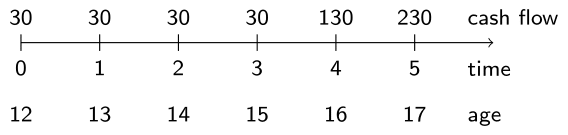
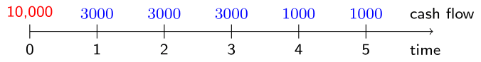
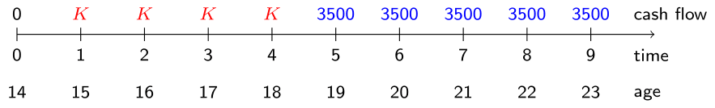
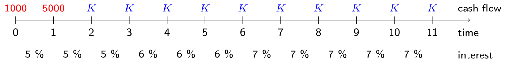
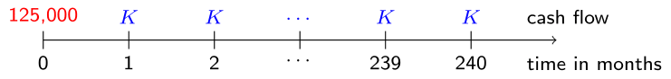

[Link to original course](https://learn.datacamp.com/courses/life-insurance-products-valuation-in-r)

# Chapter 1: Valuation of Cash Flows
Learn the basics of cash flow vectors and their valuation with discount factors. You will then evaluate investments based on their net present value and build your own mortgage calculator. Finally, you will learn about fixed and variable interest rates; and annual and monthly rates.

## Cash flows and discounting

<video width="720" controls>
	<source src="video/video1_01.mp4" type="video/mp4">
</video>

## Present value of a cash flow
### Exercise
Cynthia Rose is a 12-year old girl who is a huge Prince enthusiast. She buys his music on iTunes and plans to attend a special tribute concert in the near future. Her spending pattern on Prince-mania is sketched on the timeline printed below.

To finance her plans, she turns to her grandmother for help. How much will her grandmother have to deposit at this moment to cover all these future payments? Assume a constant interest rate of 2%. Payments take place at the beginning of the year.



### Instructions

* Define a vector `cash_flows` which contains Cynthia's expenses.
* Store the interest rate of 2% in the variable `i` and the reciprocal of the accumulation factor `1 + i` in the variable v.
* Define a vector `discount_factors` of the same length as `cash_flows` containing `v` raised to the power 0 to 5.
* Calculate the `present_value` of the cash flow vector.

```{r echo=TRUE}
# Define the cash flows
cash_flows <- c(rep(30, 4), 130, 230)
  
# Define i and v
i <- 0.02
v <- 1 / (1 + i)
  
# Define the discount factors
discount_factors <- v ^ (0:5)
  
# Calculate the present value
present_value <- sum(cash_flows * discount_factors)
present_value
```

Good job! Remember you can always use the `rep()` function to ease the notation in case of repetition in a vector.

## Net present value of investments
### Exercise
Joe, the owner of Cynthia's favorite restaurant, asks for some advice. He wants to buy a new pizza oven, worth 10,000 EUR. He expects that this investment will generate additional cash flows but he wonders whether the new oven is a profitable investment.

You should calculate the net present value (NPV) of Joe's investment. This NPV is the sum of the present values of the future cash flows (in blue) generated by the investment, minus its initial cost of 10,000 (in red) at time 0.



What is your advice for Joe? Assume that interest rates are constant and equal to 5%.

### Instructions

* Create `cash_flows` with the positive cash flows related to the investment. The vector starts with a zero.
* Define `discount_factors` as 1 plus the interest rate of 5% to minus a vector from 0 to 5.
* Compute the `net_present_value` of the investment as the present value of the future profits minus the initial cost of 10,000. Will Joe realize an overall profit or loss?

```{r echo=TRUE}
# Define the cash flows
cash_flows <- c(0, rep(3000, 3), rep(1000, 2))
  
# Define the discount factors
discount_factors <- (1 + 0.05) ^ - (0:5)
  
# Calculate the net present value
net_present_value <- sum(cash_flows * discount_factors) - 10000
net_present_value
```

Nice work! Unfortunately for Joe's restaurant the net present value is negative and hence it wouldn't be wise to make this investment. In the next video exercise you will learn more about valuing cash flows at any point in time.

## Valuation

<video width="720" controls>
	<source src="video/video1_02.mp4" type="video/mp4">
</video>

## Anywhere, anytime?
### Exercise
Reflecting upon her spending pattern, Cynthia wonders how much money she would collect if she puts her money on a bank account instead of spending it on downloads and concert tickets. To this end, you will calculate the value of the cash flows at a future point in time, using an appropriate discount function.


Cynthia's spending pattern is shown above. The `cash_flows` vector, which you defined in the first exercise, has been preloaded into your workspace. The interest rate is still 2%.

### Instructions

* Define the function `discount()` which computes the value at time $s$ of 1 EUR paid at time $t$.
* Use `discount()` to compute the present value of the `cash_flows` at times 0 to 5. This should match your earlier result, namely 444.93 EUR.
* Print the value of the cash flow vector when Cynthia turns 18 in 6 years from now.
* Compute the accumulated value of the cash flow vector at time 6 in a different way. This time convert the `present_value` at time 0 to the value at time 6.

```{r echo=TRUE}
# Define the discount function v
discount <- function(s, t, i = 0.02) {
  (1 + i) ^ - (t - s)
}

# Calculate the present value
present_value <- sum(cash_flows * discount(0, 0:5))
present_value

# Calculate the value at time 6
sum(cash_flows * discount(6, 0:5))

# Calculate the value at time 6, starting from present_value
230 * discount(present_value, 6)
```

Well done! This exercise shows that if you know the value of a cash flow at one moment in time, you can calculate the value at any moment in time. It is a bit strange to talk about a discount function when you are actually calculating a value at a point later in time. Therefore, authors sometimes prefer to define a separate function which they call the accumulation function.

## Actuarial equivalence

<video width="720" controls>
	<source src="video/video1_03.mp4" type="video/mp4">
</video>

## Saving for university
### Exercise
Cynthia's parents anticipate her graduation from high school and start saving money to finance her studies. For each study year at a Belgian university, they will need 3500 EUR.

In the timeline printed below, the red cash flows denote the saving deposits by Cynthia's parents and the blue cash flows denote the study expenses.

Assume a constant interest rate of 3%. Can you compute the value of the savings amount $K$ using the notion of **actuarial equivalence of cash flows**?



### Instructions

* Define the `discount_factors` at times 0 through 9 for the assumed interest rate of 3%.
* Create the vector `deposits`, representing the deposit pattern corresponding to all 10 time points. Since deposits are only made at time points 1 to 4, the vector `deposits` should start with a 10, then four times a 1 and then 5 times 0 again.
* Define `payments`, representing the expenses at the university. This vector should contain 0 five times, followed by 3500 (five times, again).

```{r echo=TRUE}
# Define the discount factors
discount_factors <- (1 + 0.03) ^ - (0:9)

# Define the deposit pattern
deposits <- c(0, rep(1, 4), rep(0, 5))

# Define the university expenses
payments <- c(rep(0, 5), rep(3500, 5))
```

Great! In the follow-up exercise you will use these variables to compute the value of $K$!

## Deposits of the saving plan
### Exercise
Now that you have defined the variables `discount_factors`, `deposits` and `payments`, you are ready to determine the value $K$ of the yearly savings deposits using the actuarial equivalence relationship between the deposits (red cash flow) and the payments (blue cash flow).


### Instructions

* Calculate the present value of the deposit pattern as the `sum()` of the elementwise product of `deposits` and `discount_factors`.
*Do the same for the payment pattern by summing over the product of `payments` and `discount_factors`.
* Using the concept of actuarial equivalence, the yearly deposit `K` in the first four years can be calculated by dividing `PV_payment` by `PV_deposit`.

```{r echo=TRUE}
# Calculate the present value of the deposits
PV_deposit <- sum(deposits * discount_factors) 

# Calculate the present value of the payments
PV_payment <- sum(payments * discount_factors) 

# Calculate the yearly deposit K in the first 4 years
K <- PV_payment / PV_deposit
K
```

Excellent! The concept of actuarial equivalence is very important in life insurance mathematics, so make sure to keep that one in mind!

## Change of period and term structure

<video width="720" controls>
	<source src="video/video1_04.mp4" type="video/mp4">
</video>

## The interest rates they are a-changin'
### Exercise
Cynthia wants to borrow money from her parents to finance a trip to Australia. She needs 1000 EUR this year and another 5000 EUR next year. She wants to repay the money with yearly payments $K$ as shown on the timeline below.

The interest rate in the loan agreement is not constant, but changes over time as illustrated on the timeline.



These yearly interest rates are predefined in the vector `interest`. Can you verify that under these conditions Cynthia's yearly loan payments $K$ should amount 816.86 EUR?

### Instructions

* Compute the yearly discount factors as 1 plus `interest` to the power minus 1.
* Define the discount factors from each future time point to the present moment.
* Specify the full cash flow vector with positive values 1000 and 5000 representing the loan amounts and 10 negative values `-816.86` representing the loan payments.
* Calculate the present value of the cash flow vector. This amount should be (up to rounding) equal to zero indicating an actuarial equivalence.

```{r echo=TRUE}
# Interest rates
interest <- c(rep(0.05, 3), rep(0.06, 3), rep(0.07, 5))

# Define the yearly discount factors
yearly_discount_factors <- (1 + interest) ^ ( - 1)

# Define the discount factors
discount_factors <- c(1 , cumprod(yearly_discount_factors))

# Define the cash flow vector
cash_flow <- c(1000, 5000, rep(-816.86, 10))

# Calculate the PV
PV <- sum(cash_flow * discount_factors)
PV
```

Great! Nonconstant interest rate is a much more realistic situation. Interest rates will, among others, depend on the period of time considered. If you put your money on a bank account for a short period of time, you will receive less interest than if you would promise to leave the money on the bank account for 10 years. Therefore, in normal conditions, you can expect that the interest rates will be higher for moments further into the future.

## From yearly to monthly interest rate
### Exercise
Cynthia's parents want to invest in real estate for their daughter and will borrow a capital of 125,000 EUR to finance an apartment. A local bank provides mortgage loans at a yearly interest rate of 3.04%. The parents want to pay back the loan with fixed monthly payments over the next 20 years.

Can you derive how high these monthly payments will be?

In this first exercise you will focus on the transition from yearly to monthly interest rate.

### Instructions

* Define `number_payments` as the number of payments to be made. The loan will be paid back using monthly mortgage payments over a time period of 20 years.
* Set `i` equal to the yearly nominal interest rate of 3.04%, hence 0.0304.
* Calculate the monthly interest rate `monthly_interest` from the yearly interest rate `i`.

```{r echo=TRUE}
# Define the number of payments
number_payments <- 20 * 12

# Define the yearly interest rate
i <- 0.0304
  
# Calculate the monthly interest rate
monthly_interest <- (1 + i) ^ (1 / 12) - 1
monthly_interest
```

Well done! Continue to the final exercise of this chapter to derive the value of the monthly mortgage loan payments.

## Monthly mortgage loan payments
### Exercise
Cynthia's parents receive a loan of 125,000 EUR in return for fixed monthly payments $K$ over the next 20 years as visualized in the graph below.



Using the variables `number_payments` and `monthly_interest` defined in the previous exercise, which are preloaded for you, it's up to you to determine the value of $K$ based on the principle of actuarial equivalence.

### Instructions
* Define the discount factors corresponding to the first payment month up until the last payment month. Do this by raising 1 plus `monthly_interest` to the power minus a vector from 1 until `number_payments`.
* Create the variable `payments` which reflects the payment pattern. This should be a vector of ones with length `number_payments`.
* Finally, calculate the monthly payment $K$ by dividing the mortgage amount 125,000 by the present value of the payment pattern.

```{r echo=TRUE}
# Define the discount factors
discount_factors <- (1 + monthly_interest) ^ - (1:number_payments)

# Define the payment pattern
payments <- rep(1, number_payments)

# Calculate the monthly loan payment K
K <- 125000 / sum(payments * discount_factors)
K
```

Great job! After this first chapter, you are now able to work with cash flows and discount vectors which form vital components when valuing life insurance products! In the next chapter you will learn more about survival probabilities and working with actuarial life tables.