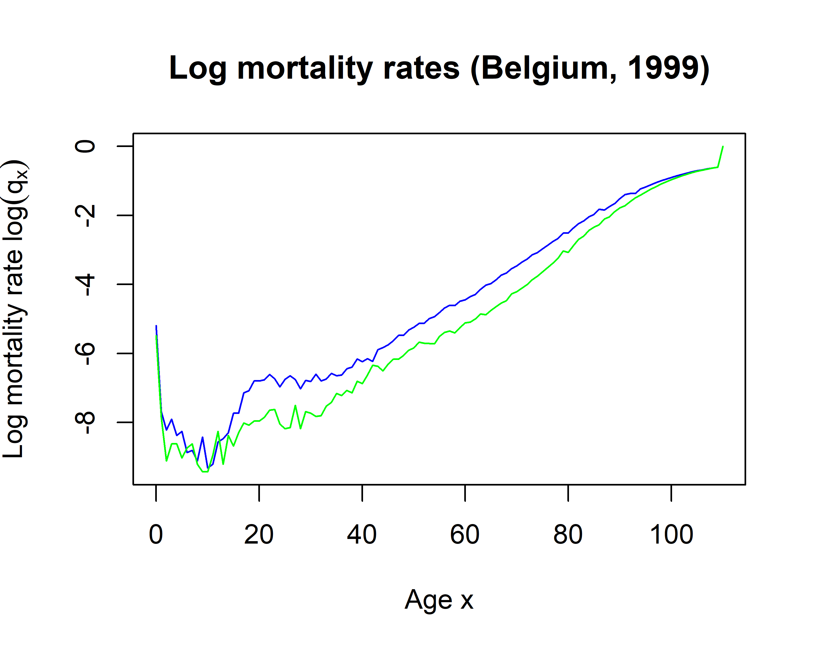

[Link to original course](https://learn.datacamp.com/courses/life-insurance-products-valuation-in-r)

# Chapter 2: Life Tables
Life tables play a vital role in life insurance products. In this chapter you will work with data sets from the Human Mortality Database by building meaningful visualizations to study the evolution of mortality data over age and time. You will also use survival and death probabilities.

## Random future lifetime

<video width="720" controls>
	<source src="video/video2_01.mp4" type="video/mp4">
</video>

## Like it's 1999!

### Exercise
Cynthia is now 18 and registered in the actuarial program at KU Leuven in Belgium. This term she takes a course on life insurance mathematics. Using R she is asked to build meaningful visualizations of lifetime data statistics. You will assist her by inspecting the Belgian mortality data for females as registered in the year 1999. This is not just Cynthia's year of birth; '1999' is also her favorite Prince song! The mortality rates have been obtained from the [Human Mortality Database](http://www.mortality.org/) and are stored in the data set `life_table`.

In this exercise, you will work with a data frame object in R by exploring what is contained in `life_table`.

```{r echo=TRUE}
life_table <- read.csv2("data/life_table_females_1999.csv")
```

### Instructions

* Verify the structure of `life_table` using the function [`str()`](https://www.rdocumentation.org/packages/utils/topics/str) and the first and last entries of `life_table` using [`head()`](https://www.rdocumentation.org/packages/utils/topics/head) and [`tail()`](https://www.rdocumentation.org/packages/utils/topics/tail).
* Extract the variables `age`, `qx` and `ex` from `life_table` using the `$` notation.
* Print the probability $q_{18}$ that an 18-year-old in 1999 would die before turning 19.
* Print the expected future lifetime $e_{18}$ of an 18-year-old in 1999.

```{r echo=TRUE}
# Inspect life_table using str(), head() and tail()
str(life_table)
head(life_table)
tail(life_table)

# Define age, qx and ex
age <- life_table$age
qx <- life_table$qx
ex <- life_table$ex

# The probability that (18) dies before turning 19
qx[age == 18]

# The expected future lifetime of (18)
ex[18 + 1]
```

Perfect! Based on the mortality rates $q_x$ you can also calculate the one-year probabilities of surviving as $p_x = 1 - q_x$. For example, the one-year probability that an 18-year-old would survive until age 19 is equal to $1 - 0.00031 = 0.99969$.

## Visualizing one year of mortality data

### Exercise
Now that you have some feeling with the 1999 life table, you can illustrate the evolution in female mortality rates $q_x$ as a function of age $x$. Cynthia's teacher usually plots the log of the mortality rates in his lecture sheets. Can you convince her that this is indeed a good approach?

The object `life_table` as well as the vectors `age` and `qx` defined in the previous exercise have been preloaded.

### Instructions

* [`plot()`](https://www.rdocumentation.org/packages/graphics/topics/plot) the mortality rates for females in 1999. The first argument has to be the `age` and the second has to be the mortality rates `qx`.
+ Use a second call to `plot()` to display the mortality rates for females in 1999 on the logarithmic scale. Compared to the previous command, you have to transform the second argument by first taking the [`log()`](https://www.rdocumentation.org/packages/base/topics/log).

```{r echo=TRUE}
# Plot the female mortality rates in the year 1999
plot(age, qx, 
    main = "Mortality rates (Belgium, females, 1999)", 
    xlab = "Age x", 
    ylab = expression(paste("Mortality rate ", q[x])), 
    type = "l")

# Plot the logarithm of the female mortality rates in the year 1999
plot(age, log(qx), 
    main = "Log mortality rates (Belgium, females, 1999)", 
    xlab = "Age x", 
    ylab = expression(paste("Log mortality rate ", log(q[x]))), 
    type = "l")
```

Well done! Now have a closer look at the plot of the logarithm of the mortality rates. The one year probabilities of dying are decreasing in the first life years and then they start increasing again. It is only around the ages in between 40 and 60 that the probabilities reach the same level again as in the very first year. A second striking feature is the so-called accident hump. This refers to the sharp increse in mortality rates during puberty. It is less present here compared to the mortality rates for males in 2013 as shown in the slides.

## Men versus women
In the previous exercises, we focused on the female life table. However, there are some clear differences between the mortality statistics of men and women. Women tend to live longer since their mortality rates are lower. The accident hump is also more outspoken for men compared to women.

Examine the plot below of mortality rates for males and females in 1999. Which line, blue or green, represents the rates for women?



**Possible Answers:**

* Blue line.
* **Green line.**
* I have no clue. (Remember that women have lower probabilities of dying and hence live longer.)

Well done. Proceed to the next video exercise to learn more about life tables!

## Binomial experiments

<video width="720" controls>
	<source src="video/video2_02.mp4" type="video/mp4">
</video>

## How likely is Cynthia to live to 100?

### Exercise
Being an R stats lover Cynthia enjoyed her first explorations of the life table for the year 1999. Using R she wants to gain more insights. Cynthia is particularly interested in the probability to become a centenarian. What is this probability for a zero-year-old, using the data of 1999? And for an 18-year-old? Can you figure out how to calculate those probabilities? Then do a visualization of $(k, _{k}p_{18})$.

In the following exercises, the 1999 period life table for females in Belgium is again preloaded and stored in the object `life_table` and the `lx` column has been extracted for you.

### Instructions

* Use `lx` to compute the probability for a zero-year-old to become a centenarian (i.e. to reach age 100). Make sure to extract by index.
* Compute the same probability for an 18-year-old.
* Calculate and plot the probabilities for an 18-year-old to survive until ages 18, 19, ... up to 100. Define `k` as a vector from 0 to 82. Use `k` to calculate the probabilities.

```{r echo=TRUE}
lx <- life_table$lx

# Compute the probabilty for (0) to reach the age 100
lx[life_table$age == 100] / lx[life_table$age == 0]

# Compute the probabilty for (18) to reach the age 100
lx[life_table$age == 100] / lx[life_table$age == 18]

# Plot the survival probabilties for (18) up to age 100
k <- 0:82
plot(k, lx[18 + k + 1] / lx[18 + 1], 
    pch = 20, 
    xlab = "k", 
    ylab = expression(paste(""[k], "p"[18])), 
    main = "Survival probabilities for (18)")
```

Awesome! Let's go on to examine the number of deaths `dx` column.

## The number of deaths

### Exercise
Cynthia's professor now asks her to explore the number of deaths in the life table. The deaths at age $x$ are labeled $d_x$. Can you picture the number of deaths $d_x$ by age $x$?

Moreover, Cynthia learned that $d_x$ is the expected number of people who die at age $x$ out of a group of $l_x$ survivors. You will generate binomial samples for the number of deaths at age $x$ and compare simulated data with the registered $d_x$.

The object `life_table` is preloaded in your R workspace as well as the extracted columns `age`, `qx`, `lx` and `dx`.

### Instructions

* Plot `dx` versus `age` to examine the number of deaths by age. Using `type = "h"` you obtain vertical lines instead of points.
* Simulate the number of deaths at each age $x$ based on the number of survivors `lx` and the mortality rates `qx`. Use [`rbinom()`](https://www.rdocumentation.org/packages/stats/topics/rbinom) to generate in a vectorized way from a binomial distribution.
* Plot the simulated number of deaths `sims` on top of the existing graph using [`points()`](https://www.rdocumentation.org/packages/graphics/topics/points). Crosses are used as symbols by specifying `pch = 4`.

```{r echo=TRUE}
dx <- life_table$dx

# Plot the number of deaths dx by age
plot(age, dx, 
    type = "h", 
    pch = 20, 
    xlab = "Age x", 
    ylab = expression("d"[x]),
    main = "Number of deaths (Belgium, females, 1999)")

# Simulate the number of deaths using a binomial distribution
sims <- rbinom(n = length(lx), size = lx, prob = qx)
  
# Plot the simulated number of deaths on top of the previous graph
points(age, sims, 
    pch = 4, 
    col = "red")
```

Way to go! Let's continue and learn more about survival probabilities.

## Calculating probabilities

<video width="720" controls>
	<source src="video/video2_03.mp4" type="video/mp4">
</video>

## Multiplication rules!

### Exercise
Cynthia is fascinated by the multiplication rule applicable to survival probabilities. She wants to verify her earlier calculated probabilities using this rule. But let's start slowly. What is the probability that she (an 18-year-old) will be alive when she is supposed to graduate from her $3+2$ year bachelor and master program?

Next, you will calculate $_{k}p_x$ for $x$ an 18-year-old female and $k=1,2,3,...$. What is the probability for an 18-year-old to reach the magic number of 100?

The column `qx` extracted from `life_table` has been preloaded. The one-year survival probabilityes `px` have been defined as one minus the mortality rates `qx`.

### Instructions

* Compute the probability of an 18-year-old to turn 23 using [`prod()`](https://www.rdocumentation.org/packages/base/topics/prod).
* Define `kpx` as the multi-year survival probabilities of an 18-year-old until the age of 100 using [`cumprod()`](https://www.rdocumentation.org/packages/base/topics/cumprod).
* Print the probability of an 18-year-old to reach the magic number of 100.
* Visualize the multi-year survival probabilities by plotting `kpx` against a vector from 1 until the [`length()`](https://www.rdocumentation.org/packages/base/topics/length) of `kpx`.

```{r echo=TRUE}
px <- 1 - life_table$qx

# Calculate the probability that (18) survives 5 more years
prod(px[(18+1):(22+1)])

# Compute the survival probabilities of (18) until the age of 100
kpx <- cumprod(px[(18+1):(99+1)])

# Extract the probability that (18) survives until the age of 100
kpx[length(kpx)]

# Plot the probabilties for (18) to reach the age of 19, 20, ..., 100
plot(1:length(kpx), kpx, 
    pch = 20, 
    xlab = "k", 
    ylab = expression(paste(""[k], "p"[18])), 
    main = "Survival probabilities for (18)")
```

Great work! Instead of specifying `1:length(kpx), kpx` as coordinates for plotting, you can also only specify `kpx` and obtain the same graph since `plot()` by default plots a vector against its index vector.

## Deferred mortality probabilities

### Exercise
In this exercise, you will help Cynthia to better understand the concept of a $k$-year deferred mortality probability for an 18-year-old. This is the probability that one first survives $k$ years, reaches age $18+k$ and then dies in the next year:

$$_{k|}q_{18}=_{k}p_18 \cdot q_{18+k}$$

These probabilities with $k = 0,1,2,...$ determine a discrete probability distribution. They run over all possible ages at death for the 18-year-old and express the corresponding probability to die at each of these ages.

The mortality rates $q_x$ and the one-year survival probabilities $p_x$ have been preloaded as `qx` and `px`.

### Instructions

* Define `kpx` as the survival probabilities $_{k}p_{18}$ of an 18-year-old for $k=0,1,2,...$.
* Assign the deferred mortality probabilities $_{k|}q_{18}$ to the variable `kqx` by multiplying `kpx` with the mortality rates `qx` from `18 + 1` until `length(px)`.
* Compute the `sum()` of `kqx` to verify that it equals one.
* Visualize the `kqx` against `0:(length(kqx) - 1)`.

```{r echo=TRUE}
# Compute the survival probabilities of (18)
kpx <- c(1, cumprod(px[(18 + 1):(length(px) - 1)]))

# Compute the deferred mortality probabilities of (18)
kqx <- kpx * qx[(18 + 1):length(px)]

# Print the sum of kqx
sum(kqx)

# Plot the deferred mortality probabilities of (18)
plot(0:(length(kqx) - 1), kqx, 
    pch = 20, 
    xlab = "k", 
    ylab = expression(paste(""['k|'], "q"[18])),
    main = "Deferred mortality probabilities of (18)")
```

Good job! In this case, you have to specify both x and y coordinates in `plot()` since plotting against the index vector would be misleading.

## Calculating life expectancies

<video width="720" controls>
	<source src="video/video2_04.mp4" type="video/mp4">
</video>

## Curtate vs complete life expectancy

### Exercise
Still working with the 1999 female life table for Belgium, Cynthia is wondering what the life expectancy was for a newborn and an 18-year-old, using the data from 1999. Moreover, she wants to check whether she can empirically verify the 0.5 difference between the complete and curtate life expectancy that was discussed during her Life Insurance Mathematics class.

Recall from the video that the curtate life expectancy can be computed as

$$E[K_{x}] = \sum^{\infty}_{k=1} _{k}p_{x}$$

The one-year survival probabilities `px` and complete life expectancy `ex` have been preloaded.

### Instructions

* Compute the curtate life expectancy of (0), a newborn female. First, define the survival probabilities `kp0` as the cumulative product of `px`. Then, print the sum of `kp0`.
* Repeat for (18), an 18-year-old female. This time, subset `px` from age 18 onwards before calculating the cumulative product.
* Compare with the complete life expectancies. Print out the subset of `ex` corresponding to ages 0 and 18 in one line using a vector of length 2 inside square brackets.

```{r echo=TRUE}
# Survival probabilities and curtate expected future lifetime of (0)
kp0 <- cumprod(px)
sum(kp0)

# Survival probabilities and curtate expected future lifetime of (18)
kp18 <- cumprod(px[(18+1):length(px)])
sum(kp18)

# Complete expected future lifetime of (0) and (18)
ex[c(0 + 1, 18 + 1)]
```

Great! Try typing `c(sum(kp0), sum(kp18)) + 0.5` in your console to see how the complete life expectancy can be accurately approximated via the curtate life expectancy.

## Plotting life expectancies by age

### Exercise
Cynthia decides to visualize the life expectancy as a function of age. Can you guide Cynthia on how to construct such a graph?

To do this efficiently in R, you should first write a function which computes the curtate life expectancy for a given age and life table. Then, you can apply this function over all ages in the life table. Using [`sapply()`](https://www.rdocumentation.org/packages/base/topics/sapply) the output is simplified to the most elementary data structure possible.

The preloaded `life_table` object contains the 1999 period life table for females in Belgium.

### Instructions

* Complete the code defining the function `curtate_future_lifetime()`.
* Create a vector `ages` by extracting the `age` column from `life_table`.
* Use [`sapply()`](https://www.rdocumentation.org/packages/base/topics/sapply) with arguments `ages`, `curtate_future_lifetime`, and `life_table` to compute the curtate life expectancy at all ages in the life table.
* Plot `future_lifetimes` versus `ages`.

```{r echo=TRUE}
# Function to compute the curtate expected future lifetime for a given age and life table
curtate_future_lifetime <- function(age, life_table) {
  px <- 1 - life_table$qx
  kpx <- cumprod(px[(age + 1):length(px)])
  return(sum(kpx))
}

# Vector of ages
ages <- life_table$age

# Curtate future lifetimes for all ages
future_lifetimes <- sapply(ages, curtate_future_lifetime, life_table)

# Future lifetime by age
plot(ages, future_lifetimes, type = 'l', lwd = 2, col = "green", xlab = "Age x", ylab = "Future lifetime", main = "Future lifetime by age")
```

Nicely done! Based on these future lifetimes for all ages, you can also compute the expected age at death by age as `ages + future_lifetimes`.

## Dynamics

<video width="720" controls>
	<source src="video/video2_05.mp4" type="video/mp4">
</video>

## Mortality rates over time

### Exercise
Cynthia downloads the most up-to-date mortality data for Belgium from the [Human Mortality Database (HMD)](http://www.mortality.org/). This data set is preloaded as `life_table`.

In this exercise, you will use two common R functions. [`with()`](http://www.rdocumentation.org/packages/base/functions/with) allows you to evaluate an R expression in a local environment constructed from a data frame. This avoids the need of repeatedly typing `life_table$` to extract columns. For instance, the log mortality rates of 18-year-olds over the years can be extracted using:

```{r eval=FALSE}
with(life_table, log(qx[age == 18]))
```

`with()` is particularly handy in combination with [`subset()`](http://www.rdocumentation.org/packages/base/functions/subset). For instance, the log mortality rate of 18-year-olds from the life table of year 1999 can be returned using:

```{r eval=FALSE}
with(subset(life_table, year == 1999), log(qx[age == 18]))
```

### Instructions

* Explore `life_table`. Print out the first 6 rows using `head()` and compute the [`range()`](https://www.rdocumentation.org/packages/base/topics/range) of the `year` variable.
* Complete the code with proper use of [`subset()`](http://www.rdocumentation.org/packages/base/functions/subset) on `life_table` such that the mortality rates of an 18-year-old female throughout the years are plotted.
* Again make use of `subset()` to select the life table of 1950 and plot the mortality rate curve in that year.

```{r echo=TRUE}
life_table <- read.csv2('data/life_table_females.csv')
```

```{r echo=TRUE}
# Explore life_table
head(life_table)
range(life_table$year)

# Plot the logarithm of the female mortality rates for (18) by year
with(subset(life_table, age == 18), 
     plot(year, log(qx), 
          type = "l", main = "Log mortality rates (Belgium, females, 18-year-old)", 
          xlab = "Year t", ylab = expression(paste("Log mortality rate ", log(q[18])))))

# Plot the logarithm of the female mortality rates in the year 1950 by age
with(subset(life_table, year == 1950), 
     plot(age, log(qx), 
          type = "l", main = "Log mortality rates (Belgium, females, 1950)",
          xlab = "Age x", ylab = expression(paste("Log mortality rate ", log(q[x])))))
```

Perfect! Did you notice in the first plot how the mortality rates are missing in between 1914 and 1918? As you can probably imagine, the lack of mortality statistics during this period is due to World War I. Feel free to run the last part of code for different years, e.g. 1841 and 2015 (the first and last year in the life table), to see how mortality rates in Belgium have shown a declining trend over the years.

## Cohort survival probabilities

### Exercise
The probability Cynthia calculated earlier for an 18-year-old in 1999 to survive until the age of 23 was in fact the period survival probability. Can you help her to adjust her computations in order to take the dynamics of the survival probabilities over time into account? The one-year survival probabilities used in the multiplication rule should hence be extracted from the life table in a diagonal way:

$$_{5}p_{18,1999} = p_{18,1999} \cdot p_{19,2000} \cdot p_{20,2001} \cdot {21,2002} \cdot {22,2003}$$

The `life_table` object from the previous exercise is still loaded.

### Instructions

* Create a print the cohort life table for females born in $1999 - 18 = 1981$ using `subset()`.
* Define the cohort one-year survival probabilities `px` from the `qx` column of `life_table_1981`.
* Compute the 5-year cohort survival probability for (18).
* Can you repeat this calculation for birth year 1881, a century earlier, in a one-line command? You will need to use both `with()` and `subset()`.

```{r echo=TRUE}
# Construct and print the cohort life table for birth year 1981
life_table_1981 <- subset(life_table, year - age == 1981)
life_table_1981

# 1981 cohort one-year survival probabilities
px <- 1 - life_table_1981$qx

# 1981 cohort survival probability that (18) survives 5 more years
prod(px[(18+1):(22+1)])

# 1881 cohort survival probability that (18) survives 5 more years
with(subset(life_table, year - age == 1881), prod(1 - qx[(18 + 1):(22 + 1)]))
```

Congratulations! You have now mastered how to work with life tables in R and are ready to take on the next step!