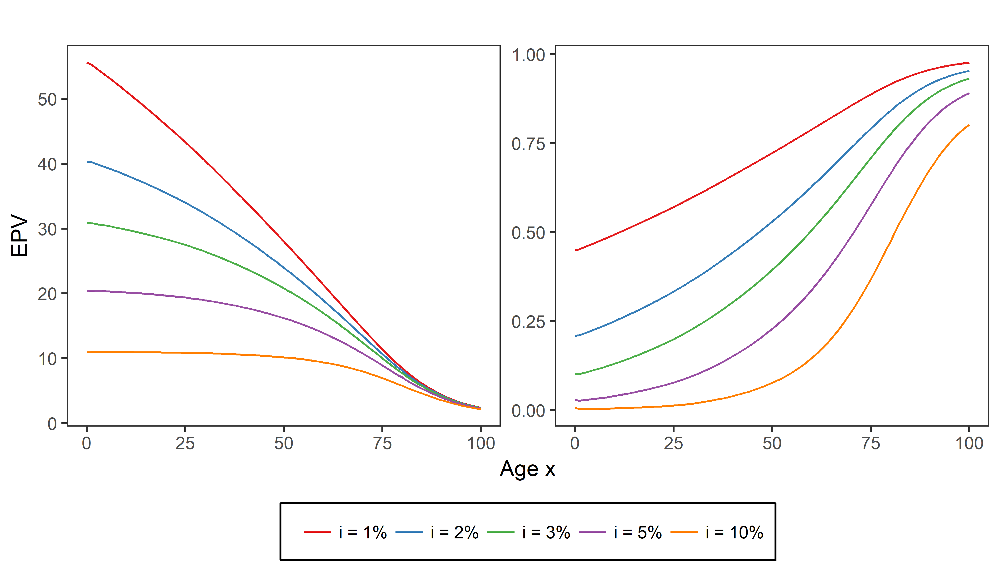
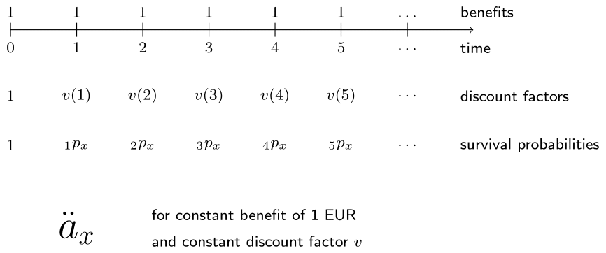
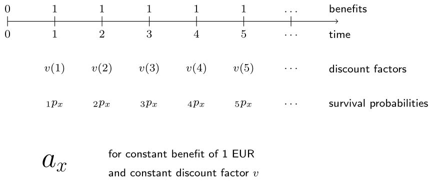
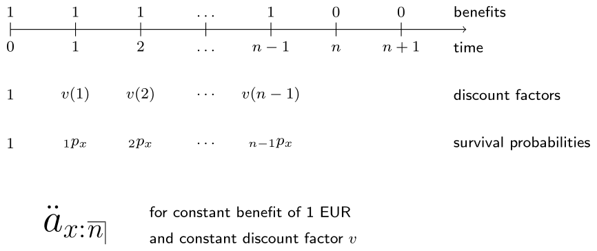
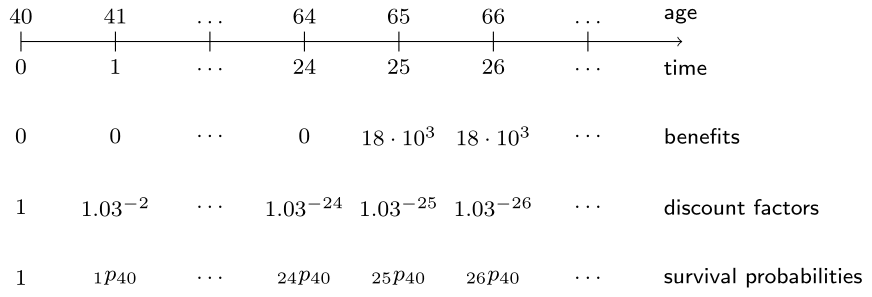
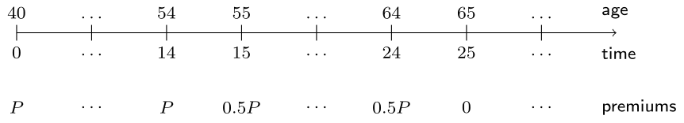

[Link to original course](https://learn.datacamp.com/courses/life-insurance-products-valuation-in-r)

# Chapter 3: Life Annuities
You will now act as an actuary working in a life insurance company. Learn about the basics of life annuity products and their valuations by working on cases ranging from simple life annuities to retirement plans.

## The basics

<video width="720" controls>
	<source src="video/video3_01.mp4" type="video/mp4">
</video>

## To survive or not to survive

### Exercise
Cynthia is 20 years old and joins the actuarial department of an insurance company for a summer internship. As a first challenge Cynthia's supervisor asks her to compare the (expected) present values of a pure endowment on the one hand versus a guaranteed payment on the other hand.

In this chapter you will always work with the 1999 period life table for females in Belgium of which the one-year survival probabilities $p_x$ have been preloaded as `px`. For this exercise you will consider a single payment of 10,000 EUR and a constant interest rate $i = 2%$.

```{r echo=TRUE}
life_table <- read.csv2('data/life_table_females_1999.csv')
#head(life_table)
px <- 1 - life_table$qx
```

### Instructions

* Compute the `PV` of a guaranteed payment of 10,000 EUR in 5 years from now at a rate of 2%.
* Define `kpx` as the 5-year survival probability $_{5}p_{20}$ of (20) by taking the product over the subset of `px` corresponding to ages 20 to 24.
* Multiply `PV` with `kpx` to obtain the expected present value of a pure endowment of 10,000 EUR in 5 years from now for 20-year-old Cynthia.

```{r echo=TRUE}
# PV of guaranteed payment of 10,000 in 5 years
PV <- 10000 * (1 + 0.02) ^ (-5)
PV

# 5 year survival probabilities of (20)
kpx <- prod(px[(20 + 1):(24 + 1)])

# EPV of pure endowment of 10,000 in 5 years for (20)
PV * kpx
```

Well done! The EPV of the pure endowment is lower than the PV of the guaranteed counterpart. The difference is due to the fact that people might die before receiving the payment of the pure endowment. This yields additional earnings for the pure endowment product on top of the interest earnings. These are sometimes referred to as the *survivorship earnings*.

## Short- and long-term

### Exercise
Let's discover what happens to the present value of the guaranteed payment and the pure endowment of 10,000 EUR when you change the time horizon from 5 to 10 or 30 years. The interest rate is still constant at $2%$ and the survival probabilities `px` have been preloaded.

### Instructions

* Assign the PVs of guaranteed payments of 10,000 EUR in 5, 10 and 30 years from now to `PV`. Use vectorization.
* Calculate the survival probabilities `kpx` of (20) using `cumprod()` on the subset of `px` starting from `20 + 1` until `length(px)`.
* Use `kpx` at times `c(5, 10, 30)` to transform the `PV` of the guaranteed payments to the EPV of the corresponding pure endowments.

```{r echo=TRUE}
# PV of guaranteed payments of 10,000 in 5, 10 and 30 years
PV <- 10000 * (1 + 0.02) ^ - c(5, 10, 30)
PV

# Survival probabilities of (20)
kpx <- cumprod(px[(20 + 1):length(px)])

# EPV of pure endowments of 10,000 in 5, 10 and 30 years for (20)
PV * kpx[c(5, 10, 30)]
```

Great work! The EPV of the pure endowments and the PV of the guaranteed counterparts clearly decline when the time horizon increases.

## The whole, temporary and deferred life annuity

<video width="720" controls>
	<source src="video/video3_02.mp4" type="video/mp4">
</video>

## Ages, interest rates and the whole life annuity
To gain some intuition, Cynthia plotted the expected present values $\ddot{a}_{x}$ of a whole life annuity due (with constant benefits of 1 EUR) for varying ages $x$ from 0 to 100 and for five different interest rates $i$. Which of the following two figures corresponds to this graph?



**Possible Answers:**

* Right figure. (Try again! The figure on the right actually represents the EPV of a whole life insurance which pays a benefit of 1 EUR upon the death of the policyholder, whenever it occurs. You will learn more about these types of products in the next chapter.)
* I have no clue. (Should the value of $\ddot{a}_{x}$ increase or decrease by $x$? Also consider the range of the y-axis.)
* **Left figure.**

Nice one! Notice how the expected present value $ddot{a}_{x}$ of a whole life annuity due decreases by the age $x$ and the interest rate $i$. At higher ages, the remaining lifetime is shorter and therefore the life annuity becomes less expensive. At higher interest rates, money grows faster resulting in lower discount factors and a lower expected present value.

## A function to price a life annuity

### Exercise
Cynthia's internship supervisor does not have much experience with R. He asks her to write an R function that calculates the EPV of a (whole) life annuity due on ($x$) for a given constant interest rate $i$ and life table.



Since the benefit is constant at 1 EUR, there is no need to take it explicitly into account in the calculations.

### Instructions

* Write a function `life_annuity_due()` that calculates the EPV of a whole life annuity due for input arguments `age`, interest rate `i` and `life_table`.
* Apply `life_annuity_due()` to compute the EPV of a life annuity due for (20) at rate 2%. Use the 1999 Belgian period life table for females which is preloaded as `life_table`.
* Find out how the EPV changes if the interest rate increases to 5% (keeping the age at 20). And what if the age changes to 65 (keeping the interest rate at 2%)?

```{r echo=TRUE}
# Function to compute the EPV of a whole life annuity due for a given age, interest rate i and life table
life_annuity_due <- function(age, i, life_table) {
  px <- 1 - life_table$qx
  kpx <- c(1, cumprod(px[(age + 1):length(px)]))
  discount_factors <- (1 + i) ^ - (0:(length(kpx) - 1))
  sum(discount_factors * kpx)
}

# EPV of a whole life annuity due for (20) at interest rate 2% using life_table
life_annuity_due(20, 0.02, life_table)

# EPV of a whole life annuity due for (20) at interest rate 5% and for (65) at interest rate 2% using life_table
life_annuity_due(20, 0.05, life_table)
life_annuity_due(65, 0.02, life_table)
```

Great job! The EPV of a life annuity can clearly vary strongly with age and interest rate.

## Immediate vs due

### Exercise
As a follow-up assignment Cynthia's supervisor asks her to figure out how to adjust the script for an immediate life annuity in which the payments start after one year.



The Belgian 1999 female life table is preloaded as `life_table` and the solution code from the previous exercise is given as a starting point. Type `life_annuity_due` to the console if you want to recall the function definition.

### Instructions

* Based on the `life_annuity_due()` function, write a new function `life_immediate_annuity()` which computes the EPV of a whole life immediate annuity. Since there is no benefit paid at time 0 for an immediate annuity, both `kpx` and `discount_factors` should be defined from time 1.
* Compute the EPV of a whole life immediate annuity for (20) at a constant interest rate of 2% using `life_table`. Verify that the result is 1 EUR lower than for the annuity due.

```{r echo=TRUE}
# EPV of a whole life annuity due for (20) at interest rate 2% using life_table
life_annuity_due(20, 0.02, life_table)

# Function to compute the EPV of a whole life immediate annuity for a given age, interest rate i and life table
life_immediate_annuity <- function(age, i, life_table) {
  px <- 1 - life_table$qx
  kpx <- cumprod(px[(age + 1):length(px)])
  discount_factors <- (1 + i) ^ - (1:length(kpx))
  sum(kpx * discount_factors)
}

# EPV of a whole life immediate annuity for (20) at interest rate 2% using life_table
life_immediate_annuity(20, 0.02, life_table)
```

Good job! The annuities computed here assume constant payments of 1 EUR. To find the EPV of annuities with constant payments of $c$ EUR, you simply have to multiply with $c$.

## Temporary vs lifelong

### Exercise
Finally, can you assist Cynthia in writing a function for a temporary life annuity due in which the payments are restricted in time? The first payment takes place at time $0$ and the last at time $n - 1$.



Both `life_table` and the R function `life_annuity_due` are still available in your workspace.

### Instructions

* Define the function `temporary_life_annuity_due()` starting from the `life_annuity_due()` code such that the EPV is computed for a temporary life annuity due. The function now has an extra argument `n` which indicates the number of payments. Both `kpx` and `discount_factors` should hence have a total length of `n`.
* Use `temporary_life_annuity_due()` to calculate the EPV of a 10-year life annuity due for (20) at rate 2% using the 1999 period life table for females.

```{r echo=TRUE}
# EPV of a whole life annuity due for (20) at interest rate 2% using life_table
life_annuity_due(20, 0.02, life_table)

# Function to compute the EPV of a temporary life annuity due for a given age, period of n years, interest rate i and life table
temporary_life_annuity_due <- function(age, n, i, life_table) {
  px <- 1 - life_table$qx
  kpx <- c(1, cumprod(px[(age + 1):(age + n - 1)]))
  discount_factors <- (1 + i) ^ - (0:(n - 1))
  sum(kpx * discount_factors)
}

# EPV of a temporary life annuity due for (20) over 10 years at interest rate 2% using life_table
temporary_life_annuity_due(20, 10, 0.02, life_table)
```

Perfect! Restricting the life annuity in time is clearly an effective way to lower the premium.

## Guaranteed payments

<video width="720" controls>
	<source src="video/video3_03.mp4" type="video/mp4">
</video>

## Pension calculations ignoring mortality

### Exercise
Cynthia’s supervisor wants to stimulate her awareness of the time value of money and the use of survival probabilities in retirement calculations. He asks Cynthia to run some pension calculations - with and without taking mortality into account - for her own situation, that is a female living in Belgium, aged 20.

Cynthia comes up with a scenario in which her future employer pays her a pension from age 65 on until age 100. Her first yearly pension payment in this scenario equals 20,000 EUR and builds up each year with 2% (to offset inflation). Assume that the interest rate for the next 45 years is 3% and 4% thereafter.

What is the present value when mortality is not taken into account? Hence, you can assume that all 36 payments from age 65 until 100 are guaranteed.

### Instructions

* Create `benefits` with the 36 pension payments starting at 20,000 at age 65 and increasing by 2% each year.
* Define the `discount_factors` to discount these payments at rate 4% to age 65.
* Compute the value at age 65 of the pension payments. Assign the result to `PV_65`.
* Discount `PV_65` over a period of 45 years at rate 3% to obtain the present value `PV_20` at age 20.

```{r echo=TRUE}
# Pension benefits
benefits <- 20000 * 1.02 ^ (0:35)

# Discount factors (to age 65)
discount_factors <- 1.04 ^ - (0:35)

# PV of pension at age 65
PV_65 <- sum(benefits * discount_factors)
PV_65

# PV of pension at age 20
PV_20 <- PV_65 * 1.03 ^ - 45 
PV_20  
```

Well done! In the follow-up exercise you will discover how these values change when taking mortality into account.

## Pension calculations accounting for mortality

### Exercise
How does the present value change if you take mortality into account? The pension payments are then no longer guaranteed but depend on the survival of the recipient. The one-year survival probabilities `px` have been preloaded as well as the variables `benefits`, `discount_factors`, `PV_65` and `PV_20` created in the previous exercise.

### Instructions

* Store the survival probabilities of a 65-year-old up to age 100 in the variable `kpx`. Make sure `kpx` starts with a 1.
* Calculate the EPV at age 65 of the pension taking mortality into account. Assign the result to `EPV_65` and compare the value to `PV_65` which does not take mortality into account.
* Discount the EPV at age 65 to the EPV at age 20 by taking both the interest rate of 3% and the survival of (20) to age 65 into account. Again, compare `EPV_20` to `PV_20`.

```{r echo=TRUE}
# Survival probabilities of (65) up to age 100
kpx <- c(1, cumprod(px[(65 + 1):(99 + 1)]))

# EPV of pension at age 65
EPV_65 <- sum(benefits * discount_factors * kpx)
cbind(PV_65, EPV_65)

# EPV of pension at age 20
EPV_20 <- EPV_65 * (1.03 ^ - 45 * prod(px[(20 + 1):(64+1)]))
cbind(PV_20, EPV_20)
```

Perfect! As you can see, it makes a huge difference whether mortality is taken into account or not!

## On premium payments and retirement plans

<video width="720" controls>
	<source src="video/video3_04.mp4" type="video/mp4">
</video>

## A retirement plan for Miss Cathleen

### Exercise
As a final assignment during her summer internship Cynthia is asked to do some calculations for Miss Cathleen. Miss Cathleen is a teacher, aged 40, who is planning for retirement. She wants to buy an annuity that provides her 18,000 EUR annually for life, beginning at age 65. Nothing is paid in case of death before 65. The figure below depicts the retirement plan for Miss Cathleen.



The one-year survival probabilities `px` are again preloaded.

### Instructions

* Define `kpx` for a 40-year-old female.
* Create `discount_factors` which discount payments at time zero (age 40) up to time `length(kpx) - 1` at rate 3%.
* Assign the pension payments to `benefits`. Make sure this vector has the same length as `kpx`.
* Compute the `single_premium` as the sum of elementwise product of `benefits`, `discount_factors` and `kpx`. Print out the result.

```{r echo=TRUE}
# Survival probabilities of (40)
kpx <- c(1, cumprod(px[(40 + 1):length(px)])) 

# Discount factors (to age 40)
discount_factors <- (1 + 0.03) ^ -(0:(length(kpx) - 1))

# Pension benefits
benefits <- c(rep(0, 25), rep(18000, length(kpx) - 25))

# The single premium
single_premium <- sum(benefits * discount_factors * kpx)
single_premium
```

Terrific! Now let's find out in the next exercise how this single premium can be transformed in annual premiums.

## From single to annual premium

### Exercise
Miss Cathleen wants to finance her deferred life annuity with annual premiums payable for 25 years beginning at age 40. But since she plans to reduce her teaching hours from age 55 on, the premium should reduce by one-half after 15 years, as shown in the graph below. What will be the initial premium to be paid by Miss Cathleen?



The variables `kpx`, `discount_factors` and `single_premium` computed in the previous exercise are preloaded.

### Instructions

* Define the premium pattern as `rho`. This vector should have the same length as `kpx`.
* Compute and print the `initial_premium` by dividing `single_premium` by the sum of the elementwise multiplication of `rho`, `discount_factors` and `kpx`.
* Inspect the annual premiums by printing the product of `initial_premium` and `rho`.
* Without taking the time value of money and the mortality into account, compute the total sum that Miss Cathleen has to pay to finance the life annuity.

```{r echo=TRUE}
# Premium pattern rho
rho <- c(rep(1, 15), rep(0.5, 10), rep(0, length(kpx) - 25))

# The initial premium
initial_premium <- single_premium / sum(rho * discount_factors * kpx)
initial_premium

# The annual premiums 
initial_premium * rho

# Sum of the annual premiums (no actuarial discounting)
sum(initial_premium * rho)
```

Perfect! You can verify that the single premium is obtained if you do take discounting and the survival probabilities into account by comparing `sum(initial_premium * rho * discount_factors * kpx)` and `single_premium` in the console. This reflects the actuarial equivalence of both cash flows.

## A good deal? Outliving your life expectancy

### Exercise
The previous premium calculations for Miss Cathleen's retirement plan are based on the 1999 Belgian period life table for women. This means that the premiums take into account how long on average a 40-year-old woman has yet to live. Recall that curtate life expectancy of (40) is computed as the sum of $_{k}p_{40}$ for $k=1,2,3,...$.

When will this product turn out to be a favorable deal? How much money will Miss Cathleen receive if she would die at age 75? Or at age 95?

The variables `kpx`, `discount_factors`, `benefits` and `single_premium` defined earlier are preloaded. Start by inspecting the value of `single_premium` once more in the console.

### Instructions

* Calculate the curtate life expectancy of Miss Cathleen as the sum of `kpx` without its first element.
* Compute the present value of Miss Cathleen's annuity benefits if she would live until 75. First define `subset1` as `1:36` which corresponds to ages 40 to 75. Compute the PV under this scenario by summing `benefits` multiplied with `discount_factors`, where both vectors have been subsetted by `subset1`.
* What would be the result if she would live until age 95?

```{r echo=TRUE}
# Curtate life expectancy of (40)
sum(kpx[-1])

# Present value of annuity benefits when (40) lives until age 75
subset1 <- 1:36
sum(benefits[subset1] * discount_factors[subset1])

# Present value of annuity benefits when (40) lives until age 95
subset2 <- 1:56
sum(benefits[subset2] * discount_factors[subset2])
```

Nicely done! Miss Cathleen is expected to reach the age of 81. Therefore, the present value of her annuity benefits will be much lower than her `single_premium` if she only lives until age 75 and much higher if she lives until age 95.