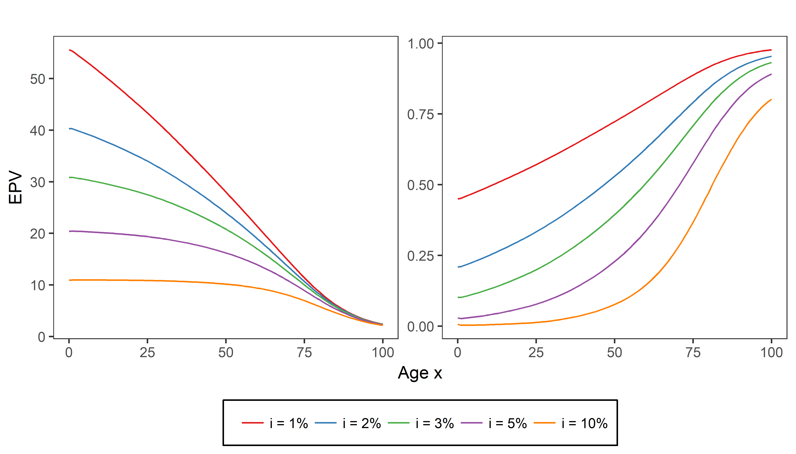

[Link to original course](https://learn.datacamp.com/courses/life-insurance-products-valuation-in-r)

# Chapter 4: Life Insurances
You will now deal with life insurance contracts. Learn how these products are relevant in your financial planning by designing whole life, temporary and endowment insurances.

## The basics

<video width="720" controls>
	<source src="video/video4_01.mp4" type="video/mp4">
</video>

## Lucy and Kevin's mortgage protection
Cynthia is now a full-fledged actuary, working for an actuarial consulting company in Belgium. Her friends, Lucy and Kevin, call for help. They are about to buy an apartment, and will sign up for a 25-year mortgage to finance this apartment. Lucy and Kevin want to buy a financial product that covers the outstanding balance on the mortgage in case one of them dies before the mortgage is settled. What kind of product do they need?

**Possible Answers:**

* A life annuity with a duration 25 years. (That can't be right! Recall that a life annuity pays out a series of payments conditional on the survival of the policyholder.)
* A pure endowment with maturity of 25 years. (Think again! Recall that a pure endownment with a maturity of 25 years pays out a lump sum in 25 years from now in case the policyholder is still alive at that time.)
* A life insurance with a duration 25 years and a constant death benefit. (Try again! The product is indeed a life insurance, but the benefit should depend on the outstanding balance of the mortgage and hence decreases over time.)
* **A life insurance with a duration 25 years and decreasing death benefit.**

Correct! A life insurance with a death benefit equal to the outstanding balance of the mortgage (and hence decreasing) is the right product for Lucy and Kevin.

## Take it easy: a simple life insurance

### Exercise
Cynthia wants to help her friend Ethan who is studying for the Long-Term Actuarial Mathematics exam organized by the Society of Actuaries. She explains him a very simple life insurance product: a product sold to $(20)$ that pays 10,000 EUR at the end of the year of death if death occurs at a given age $30$. The figure illustrates how you should value this life insurance coverage.


You can assume an interest rate $i=1%$ and use the one-year survival probabilities `px` and mortality rates `qx` which have been preloaded.

```{r echo=TRUE}
life_table <- read.csv2('data/life_table_females_1999.csv')
qx <- life_table$qx
px <- 1 - qx
```

### Instructions

* Define `kpx` as the 10-year survival probability of (20).
* Assign the 10-year deferred mortality probability of (20) to `kqx`.
* Specify the discount factor that discounts a payment at the end of year 11 to the present moment at rate 1%.
* Calculate the EPV of the simple life insurance product by multiplying the benefit of 10,000 EUR with `discount_factor` and `kqx`.

```{r echo=TRUE}
# 10-year survival probability of (20) 
kpx <- prod(px[(20+1):(29+1)])
kpx

# 10-year deferred mortality probability of (20) 
kqx <- kpx * qx[30+1]
kqx

# Discount factor
discount_factor <- (1 + 0.01) ^ - (11)
discount_factor

# EPV of the simple life insurance
10000 * discount_factor * kqx
```

Nice work! A life insurance over a longer period of time can be seen as a combination of these type of one-year contracts as you will learn in the next video.

## The whole, temporary and deferred life insurance

<video width="720" controls>
	<source src="video/video4_02.mp4" type="video/mp4">
</video>

## Life annuity vs life insurance
First a little warm-up! Which of these two figures shows the expected present value $A_x$ of a whole life insurance (with constant benefit of 1 EUR) for varying ages $x$ and interest rates $i$?



**Possible Answers:**

* Left figure (Try again! The figure on the left represents the EPV $\ddot{a}_x$  of a whole life annuity which pays out a series of 1 EUR payments conditional on the survival of the policyholder. These types of products you studied in the previous chapter.)
* **Right figure.**
* I have no clue. (Should the value of $A_x$ increase or decrease by $x$? Also consider the range of the y-axis.)

Nice one! The right figure shows how the EPV $A_x$ of a whole life insurance increases with the age $x$ as at higher ages it's more likely that the death benefit has to be paid out sooner. In addition, the EVP clearly decreases with the interest rate $i$ since a higher interest rate means that the insurer has to set less aside today to build up the future death benefit.

## Whole life insurance

### Exercise
To help out her friend Ethan who is studying for the actuarial exam, Cynthia wants to build him some R code that calculates the EPV of a (whole) life insurance on $(x)$ for a given constant interest rate $i$. Since the death benefits are constant at 1 EUR, you don't need to explicitly take them into account in the calculations.


The 1999 Belgian female life table is preloaded as `life_table`. The functions `plot_by_age()` and `plot_by_interest_rate()` have been predefined to illustrate how the EPV varies with the age $x$ of the policyholder and with the interest rate. You can inspect these functions by typing their name in the R console.

```{r echo=TRUE}
plot_by_age <- function() {
  ages <- 0:100
  EPV <- sapply(ages, whole_life_insurance, i = 0.03, life_table = life_table)
  plot(ages, EPV,
       type = 'l',
       col = "red",
       ylim = c(0, 1),
       main = "Whole life insurance (interest rate i = 3%)",
       xlab = "Age x",
       ylab = "EPV")
}

plot_by_interest_rate <- function() {
  interest_rates <- seq(0.001, 0.10, by = 0.001)
  EPV <- sapply(interest_rates, whole_life_insurance, age = 20, life_table = life_table)
  plot(interest_rates, EPV,
       type = 'l',
       col = "red",
       ylim = c(0, 1),
       main = "Whole life insurance (age 20)",
       xlab = "Interest rate i",
       ylab = "EPV")
}
```

### Instructions

* Complete the function `whole_life_insurance()` which calculates the EPV of a whole life insurance for given `age`, interest rate `i` and `life_table`.
* Run the predefined code to plot the EPV of a whole life insurance for a range of ages (at interest rate 3%) and a range of interest rates (for a 20-year-old). Interpret the resulting graphs.

```{r echo=TRUE}
# Function to compute the EPV of a whole life insurance
whole_life_insurance <- function(age, i, life_table) {
  qx <- life_table$qx
  px <- 1 - qx
  kpx <- c(1, cumprod(px[(age + 1):(length(px) - 1)]))
  kqx <- kpx * qx[(age + 1):length(qx)]
  discount_factors <- (1 + i) ^ - (1:length(kqx))
  sum(discount_factors * kqx)
}

# Plot the EPV of a whole life insurance for a range of ages at interest rate 3% using life_table
plot_by_age()

# Plot the EPV of a whole life insurance for (20) for a range of interest rates using life_table
plot_by_interest_rate()
```

Awesome! For a fixed interest rate, the EPV of a whole life insurance goes up with the age as the remaining lifetime of the insured becomes shorter and therefore the death benefit will have to be paid out sooner. For a fixed age, the EPV of the whole life insurance goes down when the interest rate increases as money grows faster and therefore the discount factors are smaller.

## Temporary life insurance

### Exercise
Ethan wonders how the EPV of a life insurance changes in case the coverage is restricted in time, as shown in the figure below.


He first calculates the EPV of a whole life insurance for a 20-year-old at an interest rate $i=2%$ and using the preloaded `life_table` for females in Belgium in 1999.

Starting from the function `whole_life_insurance()` created in the previous exercise, can you assist Cynthia in writing a function for a temporary life insurance?

### Instructions

* Define the function `temporary_life_insurance()` which computes the EPV for a temporary life insurance. Besides the recurring arguments `age`, `i` and `life_table`, the function now takes an additional argument `n` indicating the number of years the life insurance coverage holds.
* Use your newly defined `temporary_life_insurance()` function to calculate how the EPV of the life insurance of (20) at rate 2% changes when the coverage is restricted to a period of 45 years.

```{r echo=TRUE}
# EPV of a whole life insurance for (20) at interest rate 2% using life_table
whole_life_insurance(20, 0.02, life_table)

# Function to compute the EPV of a temporary life insurance
temporary_life_insurance <- function(age, n, i, life_table) {
  qx <- life_table$qx
  px <- 1 - qx
  kpx <- c(1, cumprod(px[(age + 1):(age + n - 1)]))
  kqx <- kpx * qx[(age + 1):(age + n)]
  discount_factors <- (1 + i) ^ - (1:length(kqx))
  sum(kqx * discount_factors)
}

# EPV of a temporary life insurance for (20) over a period of 45 years at interest rate 2% using life_table
temporary_life_insurance(20, 45, 0.02, life_table)
```

Perfect! In this setting, the EPV of the life insurance for (20) becomes almost 6 times smaller when we restrict the coverage over a period of 45 years.

## Deferred life insurance

### Exercise
Cynthia now challenges Ethan to change the code himself to calcualte the EPV of a deferred life insurance on $(x)$ for a given contant interest rate $i$. The following figure shows the corresponding timeline for a deferral period of $u$ years.


There is no death benefit if the policyholder dies during the first $u$ years. From time $u$ on, a death benefit of 1 EUR is payable at the end of the year of death of the policyholder.

The function `whole_life_insurance()` and the EPV of a whole life insurance for a 20-year-old at interest rate $i = 2%$ and using the 1999 female `life_table` are given as a starting point.

### Instructions

* Specify the `deferred_life_insurance()` function which computes the EPV of a deferred life insurance for a given `age`, deferral period `u`, interest rate `i` and `life table`.
* Apply the `deferred_life_insurance()` function to compute the EPV of a life insurance with a deferral period of 45 years. Use age 20, interest rate 2% and the preloaded 1999 female `life_table`.

```{r echo=TRUE}
# EPV of a whole life insurance for (20) at interest rate 2% using life_table
whole_life_insurance(20, 0.02, life_table)

# Function to compute the EPV of a deferred whole life insurance
deferred_life_insurance <- function(age, u, i, life_table) {
  qx <- life_table$qx;  px <- 1 - qx
  kpx <- c(1, cumprod(px[(age + 1):(length(px) - 1)]))
  kqx <- kpx * qx[(age + 1):length(qx)]
  discount_factors <- (1 + i) ^ - (1:length(kqx))
  benefits <- c(rep(0, u), rep(1, length(kpx) - u))
  sum(benefits * discount_factors * kqx)
}

# EPV of a deferred life insurance for (20) deferred over 45 years at interest rate 2% using life_table
deferred_life_insurance(20, 45, 0.02, life_table)
```

Well done! It should be no surprise that the EPV is lower for the deferred life insurance compared to the whole life insurance.

## Combined benefits

<video width="720" controls>
	<source src="video/video4_03.mp4" type="video/mp4">
</video>

## A life insurance plan for Miss Cathleen

### Exercise
Cynthia helped Miss Cathleen while she was an intern with a life insurance company. Now, Miss Cathleen, aged 48, seeks for financial protection in case she would die around her retirement. To protect her growing-up children she wants to insure a benefit of 40,000 EUR for death between age 55 and 75, as shown below.


To value this temporary life insurance plan you will once again use the 1999 Belgian female life table, of which the one-year survival probabilities `px` and mortality rates `qx` have been preloaded. The assumed interest rate of 5% is available as `i`.

### Instructions

* Calculate the deferred mortality probabilities $q_{48}, _{1|}q_{48},...,_{26|}q_{48}$ of a 48-year-old up to age 75 as the product of multi-year survival probabilities and mortality rates.
* Define the appropriate discount factors at rate `i`.
* Specify the `benefits` vector as the death benefits of this temporary life insurance.
* Compute the expected present value of the plan.

```{r echo=TRUE}
i <- 0.05

# Deferred mortality probabilites of (48)
kqx <- c(1, cumprod(px[(48 + 1):(73 + 1)])) * qx[(48 + 1):(74+1)]

# Discount factors
discount_factors <- (1 + i) ^ - (1:length(kqx))

# Death benefits
benefits <- c(rep(0, 7), rep(40000, length(kqx) - 7))

# EPV of the death benefits                      
EPV_death_benefits <- sum(benefits * discount_factors * kqx)
EPV_death_benefits
```

Good job! In the final exercise you will extend Miss Cathleen's insurance plan with a savings component.

## Best of both worlds - the endowment insurance

### Exercise
Cynthia knows Miss Cathleen’s family and their financial situation quite well. Cynthia suggests her to think about retirement home expenses and to add a savings component to her policy that pays 80,000 EUR if she is alive at age 75. Miss Cathleen wants to finance this endowment insurance using constant premiums $P$. The full setup of the life insurance plan is visualized in the following timeline.


The survival probabilities `px`, the interest rate `i` and `EPV_death_benefits`, which you computed in the previous exercise, are available in your workspace. Now it is up to you to determine the premium level $P$.

### Instructions

* Determine the EPV of the pure endowment by multiplying the benefit of 80,000, the discount factor $(1+i)^{-27}$ and the survival probability $_{27}p_{48}$.
* Calculate the EPV of the premium pattern and assign the result to `EPV_rho`.
* Print the premium level $P$ using the concept of actuarial equivalence.

```{r echo=TRUE}
# Pure endowment
EPV_pure_endowment <- 80000 * (1 + i) ^  - 27 * prod(px[(48+1):(74+1)])
EPV_pure_endowment

# Premium pattern
kpx <- c(1, cumprod(px[(48+ 1):(73+1)]))
discount_factors <- (1 + i) ^ - (0:(length(kpx) - 1)) 
rho <- rep(1, length(kpx))
EPV_rho <- sum(rho * discount_factors * kpx)
EPV_rho

# Premium level
(EPV_death_benefits + EPV_pure_endowment) / EPV_rho
```

Impressive work!

## Wrap-up

<video width="720" controls>
	<source src="video/video4_04.mp4" type="video/mp4">
</video>